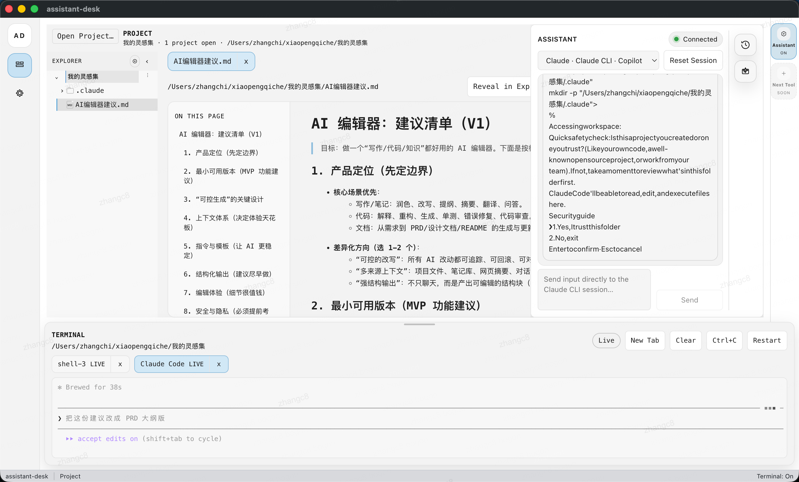

# Inspiration

[English](#english) | [中文](#中文)

---

# English

Inspiration is a macOS desktop AI coding workspace that brings together:

- **Assistant chat** (LLM-backed)
- **Terminal** (PTY-powered)
- **Multi-project explorer**

Built with **Electron + Vite + React + TypeScript**.



## Latest release

Current stable release: **v0.1.7**

- Renamed the user-facing app to `Inspiration` and refreshed the shipped icon with a new minimal visual mark.
- Added an in-app updater flow under `Settings > App` so users can check the latest release and download the correct installer without going back to GitHub manually.
- Clarified version display for development builds so local work-in-progress windows no longer pretend to be a published release.

## Who is this for?

- **End users**: download the packaged app and use it as your local coding desk.
- **Developers**: run from source, iterate on the UI/core server, and ship macOS builds.

## Features

- Desktop workspace for AI-assisted coding
- Integrated terminal experience
- Project navigation across multiple folders/projects
- Local runtime persistence (tokens are stored at runtime in local app settings — not compiled into the app)

## Platform support

- **macOS**: supported (arm64 / x64 / local universal builds)
- Windows / Linux: not currently documented in this repo

## Install (for users)

> This project’s recommended end-user distribution is the **`.dmg`** artifact.

1. Download the latest **`.dmg`** (or `.zip` fallback) from your release channel (e.g. GitHub Releases).
2. Open the `.dmg` and drag **Inspiration** into **Applications**.
3. Launch the app.

### If macOS blocks the app (unsigned builds)

For internal testing, unsigned builds can still be opened:

1. Right-click the app and choose **Open**.
2. Confirm the system dialog.

## Quick start (for developers)

### Prerequisites

- Node.js + npm
- macOS (for packaging/testing)

### Install

```bash
npm install
```

### Run in development (desktop app)

```bash
npm run mvp:dev
```

### Useful commands

```bash
npm run build
npm run electron:build
npm run lint
```

## Build & package for macOS

This repo uses `electron-builder` for macOS releases.

### Build distributables

```bash
npm run dist:mac
```

### Additional build targets

```bash
npm run dist:mac:arm64
npm run dist:mac:x64
npm run dist:mac:universal
```

### Output directory

Artifacts are written to:

```bash
release/
```

Typical outputs:

```bash
release/Inspiration-<version>-arm64.dmg
release/Inspiration-<version>-arm64.zip
release/Inspiration-<version>-x64.dmg
release/Inspiration-<version>-x64.zip
```

### App icon

The macOS `.icns` icon is generated from:

```bash
build/icons/app-icon.svg
```

Regenerate icon only:

```bash
npm run icon:build
```

## Release flow (GitHub)

This repo includes a GitHub Actions workflow:

```bash
.github/workflows/release.yml
```

When you push a tag like `v0.1.0`, it will:

1. Build **arm64** on `macos-14`
2. Build **x64** on `macos-13`
3. Upload artifacts to GitHub Releases

## Signing & notarization (optional)

Unsigned builds are fine for internal testing.

For public distribution, add Apple code signing and notarization.

Repository secrets referenced by the existing workflow/setup:

```bash
APPLE_ID
APPLE_APP_SPECIFIC_PASSWORD
APPLE_TEAM_ID
CSC_LINK
CSC_KEY_PASSWORD
```

If notarization env vars are missing, packaging still succeeds but notarization is skipped.

Entitlements:

```bash
build/entitlements.mac.plist
```

## Security & privacy notes

- API tokens are **not** compiled into the bundle.
- Tokens are stored at runtime in **local app settings**.

## Contributing

Issues and PRs are welcome.

Suggested workflow:

1. Create a feature branch
2. Make changes
3. Run `npm run lint` and smoke-test `npm run mvp:dev`
4. Open a PR

---

# 中文

Inspiration 是一款 **macOS 桌面端 AI 编程工作台**，把以下能力放到一个应用里：

- **助手聊天**（由大模型驱动）
- **内置终端**（基于 PTY）
- **多项目/多目录浏览器**

技术栈：**Electron + Vite + React + TypeScript**。

## 当前版本

当前稳定版本：**v0.1.5**

- 新增 Collaborate / Immerse 两种 Assistant 布局，可在并排协作与沉浸对话之间快速切换。
- 优化 Assistant 聊天体验，调整消息左右分布、profile 控件布局，以及底部输入区比例。
- 修复 Claude CLI 运行结果回流 ChatPage 不稳定的问题。

## 适用人群

- **使用者**：直接下载打包好的 App（推荐 `.dmg`）安装使用。
- **开发者**：从源码启动与调试，迭代 UI / core server，并构建 macOS 安装包。

## 功能概览

- 桌面端一体化的 AI 辅助编程工作区
- 集成终端体验
- 多项目/多目录管理与浏览
- 本地运行期持久化（API Token 运行时保存在本地设置中，不会被编译进安装包）

## 平台支持

- **macOS**：已支持（arm64 / x64 / 本地 universal）
- Windows / Linux：本仓库暂未提供明确支持说明

## 安装（面向使用者）

> 面向使用者分发时，推荐使用 **`.dmg`**。

1. 从发布渠道（例如 GitHub Releases）下载最新的 `.dmg`（或 `.zip` 作为备选）。
2. 打开 `.dmg`，将 **Inspiration** 拖入 **应用程序**。
3. 启动应用。

### 遇到 macOS 安全拦截（未签名构建）

内部测试时可按如下方式打开：

1. 右键应用选择 **打开**
2. 在系统弹窗中确认

## 快速开始（面向开发者）

### 前置依赖

- Node.js + npm
- macOS（用于打包/测试）

### 安装依赖

```bash
npm install
```

### 开发模式运行（桌面端）

```bash
npm run mvp:dev
```

### 常用命令

```bash
npm run build
npm run electron:build
npm run lint
```

## macOS 打包

本项目使用 `electron-builder` 进行 macOS 打包。

### 生成可分发安装包

```bash
npm run dist:mac
```

### 其它目标

```bash
npm run dist:mac:arm64
npm run dist:mac:x64
npm run dist:mac:universal
```

### 输出目录

构建产物会写入：

```bash
release/
```

常见产物：

```bash
release/Inspiration-<version>-arm64.dmg
release/Inspiration-<version>-arm64.zip
release/Inspiration-<version>-x64.dmg
release/Inspiration-<version>-x64.zip
```

### 应用图标

macOS 的 `.icns` 会由以下文件生成：

```bash
build/icons/app-icon.svg
```

仅重新生成图标：

```bash
npm run icon:build
```

## 发版流程（GitHub）

仓库包含 GitHub Actions 工作流：

```bash
.github/workflows/release.yml
```

推送类似 `v0.1.0` 的 Tag 后将：

1. 在 `macos-14` 构建 **arm64**
2. 在 `macos-13` 构建 **x64**
3. 上传产物到 GitHub Releases

## 签名与公证（可选）

未签名构建适用于内部测试。

若要公开分发，建议配置 Apple 代码签名与 notarization。

当前工作流/配置涉及的 secrets：

```bash
APPLE_ID
APPLE_APP_SPECIFIC_PASSWORD
APPLE_TEAM_ID
CSC_LINK
CSC_KEY_PASSWORD
```

若 notarization 相关环境变量缺失，打包仍会成功，但会跳过公证步骤。

权限配置：

```bash
build/entitlements.mac.plist
```

## 安全与隐私说明

- API Token **不会**被编译进安装包。
- Token 会在运行时保存到**本地应用设置**中。

## 参与贡献

欢迎提 Issue 和 PR。

建议流程：

1. 从 `main` 拉分支
2. 提交改动
3. 运行 `npm run lint`，并用 `npm run mvp:dev` 进行基本冒烟测试
4. 发起 PR
